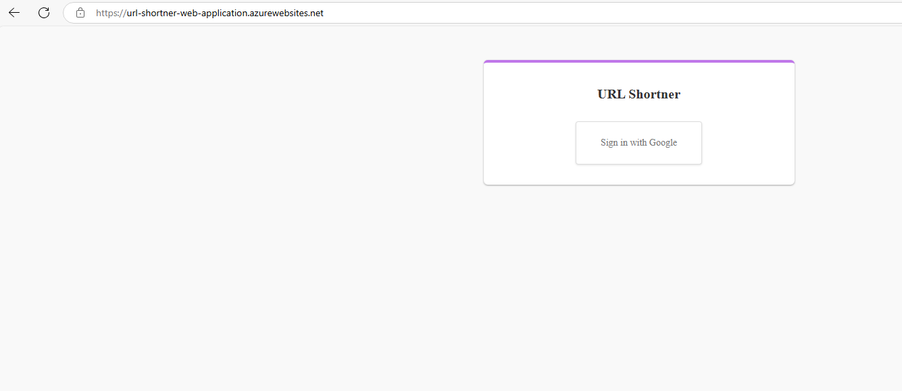
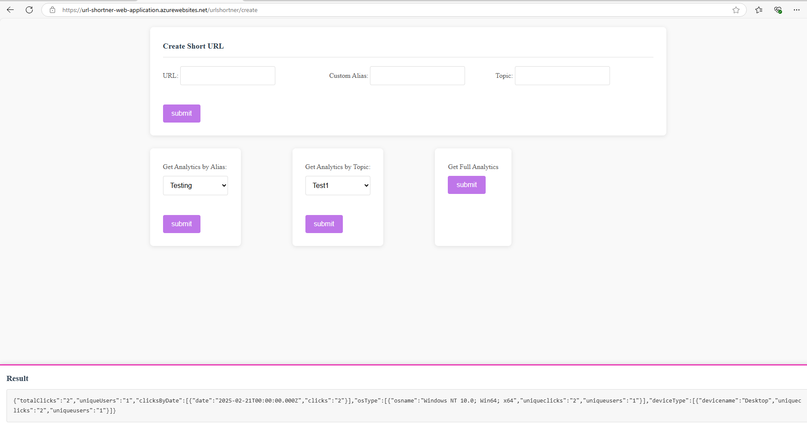

# Custom URL Shortener API

A scalable URL shortener API with advanced analytics, Google Sign-In authentication, and rate limiting.

 ## Live URL for Application: 
 
 [https://url-shortner-web-application.azurewebsites.net/](https://url-shortner-web-application.azurewebsites.net/)

## Application Page



 

## Overview

This application allows users to create shortened URLs, group them by topics, and access detailed analytics about link usage. The log tracks various metrics including clicks, unique visitors, device types, and operating systems.

## Technology Stack

- **Backend**: Express.js
- **Authentication**: JWT, Google Sign-In
- **Database**: Azure PostgreSQL Flexible Server (for user data, URLs, and logs)
- **Caching**: Redis Cloud
- **Containerization**: Docker Container, Azure Container Registry
- **Deployment**: Azure App Service - Container Apps

## Project Structure

```
├── config/
│   ├── cacheDatabase.js    # Redis configuration
│   └── database.js         # PostgreSQL configuration
├── middleware/
│   ├── authentication.js   # JWT auth middleware
│   ├── caching.js          # Redis caching middleware
│   ├── logging.js          # Request logging middleware
│   └── rateLimiting.js     # API rate limiting
├── node_modules/
├── public/
│   └── css/
│       └── style.css       # Application styles
├── routes/
│   ├── apiAuth.js          # Authentication endpoints
│   ├── apiUrlShortener.js  # URL shortening endpoints
│   ├── apiUrlShortenerAnalytics.js # Analytics endpoints
│   └── urlShortener.js     # URL redirection
├── utils/
│   └── getAnalyticsFromLogs.js # Analytics processing utilities
├── views/
│   └── partials/
│       ├── footer.ejs      # Footer template
│       ├── header.ejs      # Header template
│       └── createShortURL.ejs # URL creation form
├── .env                    # Environment variables
├── package-lock.json       # Dependency lock file
├── package.json           # Project dependencies
└── server.js              # Application entry point
```

## Database Schema

### Users Table

```sql
CREATE TABLE users(
    user_id UUID DEFAULT uuid_generate_v4() UNIQUE,
    name VARCHAR(255),
    email VARCHAR(255) UNIQUE,
    provider VARCHAR(255),
    created_datetime TIMESTAMPTZ DEFAULT CURRENT_TIMESTAMP
);
```

### URL Table

```sql
CREATE TABLE url(
    user_id UUID NOT NULL,
    long_url VARCHAR(255),
    url_id VARCHAR(255) UNIQUE,
    url_custom_alias VARCHAR(255) UNIQUE,
    topic VARCHAR(255),
    alias VARCHAR(255),
    created_datetime TIMESTAMPTZ DEFAULT CURRENT_TIMESTAMP,
    FOREIGN KEY (user_id) REFERENCES users(user_id)
);
```

### Logs Table

```sql
CREATE TABLE logs(
    user_id UUID NOT NULL,
    alias VARCHAR(255),
    topic VARCHAR(255),
    timestamp TIMESTAMPTZ DEFAULT CURRENT_TIMESTAMP,
    ip VARCHAR(255),
    os VARCHAR(255),
    device VARCHAR(255),
    geolocation VARCHAR(255)
);
```

## API Endpoints

### Authentication

**Request Headers:**

```
Cookie: auth=<jwt-token>
```

### URL Shortening

#### Create Short URL

```
POST /api/shorten
```

**Request Body:**
```json
{
  "longUrl": "https://test.com/shortening",
  "customAlias": "alias",  // optional
  "topic": "test"         // optional
}
```

**Response:**
```json
{
  "shortUrl": "https://localhost:3000/test",
  "createdAt": "2025-02-21T12:00:00Z"
}
```

**Rate Limiting:**
- 100 requests per 15 minutes per user

#### Redirect to Original URL

```
GET /api/<alias>
```

**Response:**
- Redirect to the original long URL
- Store long URL in Cache (Redis database)
- Each redirect is logged for analytics purposes

### Analytics

#### Get URL-Specific Analytics

```
GET /api/analytics/:alias
```

**Response:**
```json
{
  "totalClicks": 1245,
  "uniqueUsers": 892,
  "clicksByDate": [
    { "date": "2025-02-15", "clicks": 150 },
    { "date": "2025-02-16", "clicks": 203 },
    // ...last 7 days
  ],
  "osType": [
    { "osName": "Windows", "uniqueClicks": 523, "uniqueUsers": 410 },
    { "osName": "macOS", "uniqueClicks": 324, "uniqueUsers": 256 },
    { "osName": "iOS", "uniqueClicks": 198, "uniqueUsers": 142 },
    { "osName": "Android", "uniqueClicks": 153, "uniqueUsers": 84 },
    { "osName": "Linux", "uniqueClicks": 47, "uniqueUsers": 38 }
  ],
  "deviceType": [
    { "deviceName": "desktop", "uniqueClicks": 894, "uniqueUsers": 704 },
    { "deviceName": "mobile", "uniqueClicks": 351, "uniqueUsers": 188 }
  ]
}
```

#### Get Topic-Based Analytics

```
GET /api/analytics/topic/:topic
```

**Response:**
```json
{
  "totalClicks": 3562,
  "uniqueUsers": 1845,
  "clicksByDate": [
    { "date": "2025-02-15", "clicks": 450 },
    { "date": "2025-02-16", "clicks": 523 },
    // ...recent dates
  ],
  "urls": [
    {
      "shortUrl": "https://localhost:3000/test",
      "totalClicks": 1245,
      "uniqueUsers": 892
    },
    {
      "shortUrl": "https://localhost:3000/test123",
      "totalClicks": 876,
      "uniqueUsers": 543
    },
  ]
}
```

#### Get Overall Analytics

```
GET /api/analytics/overall
```

**Response:**
```json
{
  "totalUrls": 24,
  "totalClicks": 8962,
  "uniqueUsers": 3845,
  "clicksByDate": [
    { "date": "2025-02-15", "clicks": 1250 },
    { "date": "2025-02-16", "clicks": 1523 },
  ],
  "osType": [
    { "osName": "Windows", "uniqueClicks": 3823, "uniqueUsers": 1910 },
    { "osName": "macOS", "uniqueClicks": 2324, "uniqueUsers": 1156 },
    { "osName": "iOS", "uniqueClicks": 1398, "uniqueUsers": 542 },
    { "osName": "Android", "uniqueClicks": 1053, "uniqueUsers": 384 },
    { "osName": "Linux", "uniqueClicks": 347, "uniqueUsers": 138 }
  ],
  "deviceType": [
    { "deviceName": "desktop", "uniqueClicks": 6494, "uniqueUsers": 3204 },
    { "deviceName": "mobile", "uniqueClicks": 2451, "uniqueUsers": 688 }
  ]
}
```

## Caching Strategy

The application uses Redis for caching to improve performance:

1. **URL Redirection Caching**: 
   - Long URLs are cached with short aliases as keys for 1 hour
   - Reduces database load during redirection

## Deployment

### Docker Setup

The application is fully containerized for easy deployment to any cloud service.

```bash
# Build the Docker image
docker build -t url-shortener-api .


### Environment Variables

Create a `.env` file in the root directory with the following variables:

```
HOST = <>

PGSQL_HOST=  <>
PGSQL_PORT=  <>
PGSQL_USER=  <>
PGSQL_PASSWORD=  <>
PGSQL_DATABASE= <>

REDIS_HOST =  <>
REDIS_USER =  <>
REDIS_PASSWORD =  <>
REDIS_PORT =  <>

AUTH_GOOGLE_ID= <>
AUTH_GOOGLE_SECRET= <>

AUTH_GOOGLE_OAUTH_URL=  <>
AUTH_GOOGLE_CALLBACK_URL=  <>
AUTH_GOOGLE_ACCESS_TOKEN_URL=  <>
AUTH_GOOGLE_TOKEN_INFO_URL=  <>

JWT_SECRET =  <>

PORT=  <>

```

## Getting Started in Development environment

1. Clone the repository
2. Install dependencies: `npm install`
3. Set up PostgreSQL and Redis
4. Configure environment variables
5. Run the application: `npm start`

